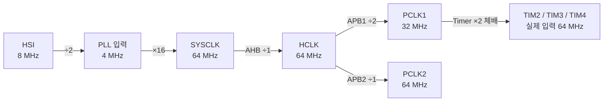
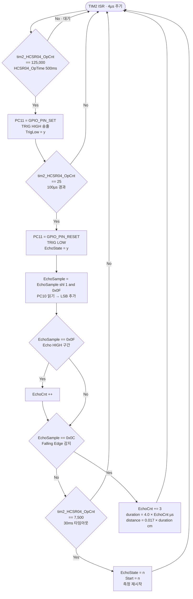
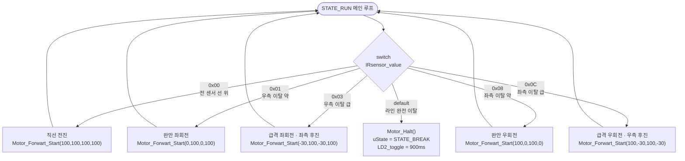
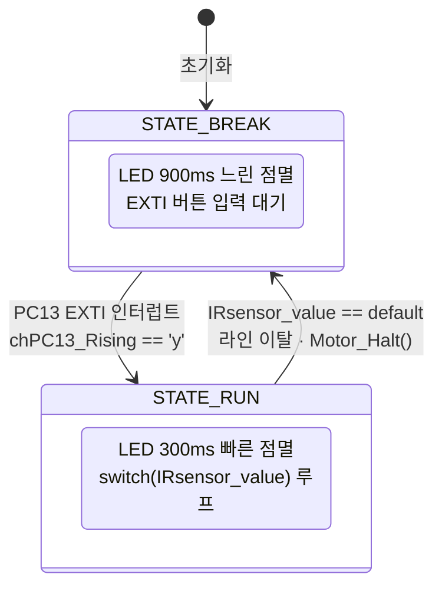
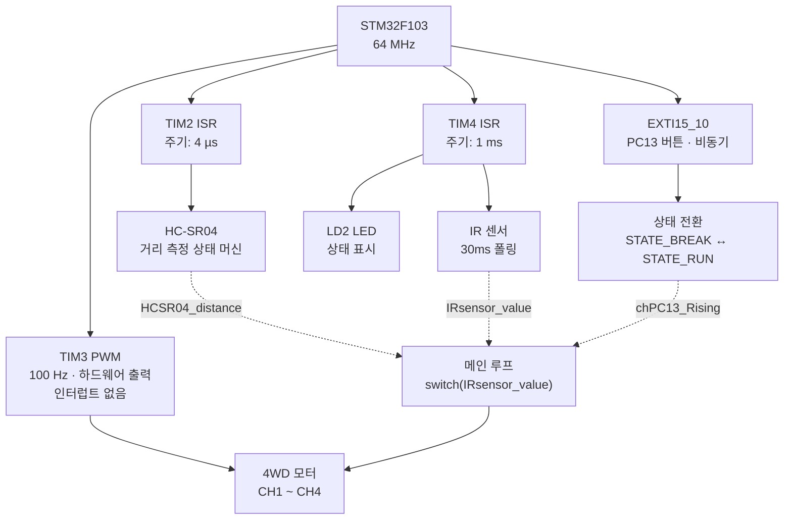

# [STM32F103] 인터럽트(ISR) 기반 4WD 자율주행 플랫폼

인터럽트(ISR) 기반의 비차단(Non-blocking) 아키텍처로 HC-SR04 초음파 센서, IR 라인 센서, L298N 모터 드라이버를 동시에 제어한다.

---

<br>

## 목차

- [하드웨어 구성](#하드웨어-구성)
- [시스템 클럭 구성](#시스템-클럭-구성)
- [타이머 설계](#타이머-설계)
- [핵심 구현: 모터 제어](#핵심-구현-모터-제어)
- [핵심 구현: HC-SR04 인터럽트 기반 거리 측정](#핵심-구현-hc-sr04-인터럽트-기반-거리-측정)
- [핵심 구현: IR 센서 기반 라인 추종](#핵심-구현-ir-센서-기반-라인-추종)
- [상태 머신 구조](#상태-머신-구조)
- [GPIO 핀 매핑](#gpio-핀-매핑)
- [빌드 환경](#빌드-환경)
- [인터럽트 구조 요약](#인터럽트-구조-요약)
- [기술문서](#기술문서)

---

<br>

## 하드웨어 구성

| 구성 요소 | 모델 |
|-----------|------|
| MCU | STM32F103C8T6 (Nucleo-64) |
| 차체 | DFRobot 4WD Mobile Platform |
| 모터 드라이버 | L298N Dual H-Bridge |
| 거리 센서 | HC-SR04 초음파 센서 |
| 라인 센서 | IR 반사형 센서 - 4채널 |
| 전원 | 18650 Li-ion 배터리 x 2 |

---

<br>

## 시스템 클럭 구성

STM32F103의 내부 RC 오실레이터(HSI, 8 MHz)를 PLL로 체배하여 64 MHz 시스템 클럭을 구성한다.



> APB1 버스의 타이머는 PCLK1 프리스케일러가 1이 아닐 때 ×2 체배되므로,
> TIM2 / TIM3 / TIM4의 실제 입력 클럭은 **64 MHz**.

---

<br>

## 타이머 설계

세 개의 타이머를 역할에 따라 분리하여 서로 간섭 없이 동작하도록 구성했다.

<br>

### TIM2 — HC-SR04 타이밍 제어 (4 µs 인터럽트)

```
f_tick = 64 MHz / PSC / ARR = 64,000,000 / 32 / 8 = 250,000 Hz → 주기 4 µs
```

`PSC = 32 - 1 = 31`, `ARR = 8 - 1 = 7`

HC-SR04의 Trigger 펄스(최소 10 µs)와 Echo 펄스 계측을 µs 단위로 처리하기 위해 가장 짧은 주기로 설정했다.
HAL_Delay 대신 ISR 내부의 카운터(`tim2_HCSR04_OpCnt`)로 시간을 측정하므로 메인 루프를 차단하지 않는다.

<br>

### TIM3 — 4WD 모터 PWM 출력 (100 Hz)

```
f_PWM = 64 MHz / PSC / ARR = 64,000,000 / 640 / 1,000 = 100 Hz
```

`PSC = 640 - 1 = 639`, `ARR = 1000 - 1 = 999`

TIM3 CH1 ~ CH4를 4개의 바퀴에 각각 할당한다.
듀티비는 ARR 기준 퍼센트로 직접 계산하여 CCR 레지스터에 쓴다:

```c
CCR = (ARR * duty_percent) / 100
```

모터 드라이버 L298N의 PWM 주파수 권장 범위(수십 ~ 수백 Hz) 내에서 가청 노이즈와 발열을 최소화하도록 100 Hz로 설정했다.

<br>

### TIM4 — IR 센서 폴링 + LED 상태 표시 (1 ms 인터럽트)

```
f_tick = 64 MHz / PSC / ARR = 64,000,000 / 64 / 1,000 = 1,000 Hz → 주기 1 ms
```

`PSC = 64 - 1 = 63`, `ARR = 1000 - 1 = 999`

1 ms 단위 카운터로 IR 센서 샘플링 주기(30 ms)와 LD2 LED 점멸 주기를 동시에 관리한다.
두 기능이 같은 ISR 안에서 독립 카운터로 동작하기 때문에 타이머 리소스를 효율적으로 사용한다.

---

<br>

## 핵심 구현: 모터 제어

### L298N H-Bridge 방향 제어

L298N은 IN1/IN2 핀 조합으로 한 채널의 회전 방향을 결정한다.

| IN (I핀) | OUT (O핀) | 방향 |
|----------|-----------|------|
| HIGH | LOW | 전진 |
| LOW | HIGH | 후진 |
| LOW | LOW | 정지 |

이를 추상화한 `Motor_Dir_t` 열거형과 바퀴별 방향 함수를 정의했다:

```c
typedef enum {
    DIR_BACK  = GPIO_PIN_RESET,
    DIR_FRONT
} Motor_Dir_t;

void Motor_FrontL_Direction(Motor_Dir_t dir) {
    HAL_GPIO_WritePin(GPIODir, GPIO_PIN_DirFrontLI,  dir);
    HAL_GPIO_WritePin(GPIODir, GPIO_PIN_DirFrontLO, !dir);
}
```

<br>

### 부호 있는 PWM으로 바퀴별 독립 방향 제어

기존 단순 전진 제어 코드는 `uint32_t` 파라미터로 항상 전진 방향만 지원한다.
이 프로젝트에서는 파라미터를 `int`(부호 있는 정수)로 변경하여, **음수 값을 입력하면 해당 바퀴가 후진**하도록 확장했다:

```c
void Motor_Forwart_Start(int pwm_FL, int pwm_FR, int pwm_RL, int pwm_RR) {
    if (pwm_FL < 0) { Motor_FrontL_Direction(DIR_BACK);  pwm_FL = -pwm_FL; }
    else            { Motor_FrontL_Direction(DIR_FRONT); }
    // FR, RL, RR 동일 패턴 ...
    Motor_Change_Speed(pwm_FL, pwm_FR, pwm_RL, pwm_RR);
}
```

이 구조 덕분에 좌/우 바퀴가 **서로 반대 방향으로 회전**하는 제자리 회전(Tank Turn)이 가능하다.

**실제 커브 구현 예시:**

```c
// 완만한 좌회전: 좌측 바퀴 정지, 우측 바퀴 전진
Motor_Forwart_Start(0, 100, 0, 100);

// 급격한 좌회전: 좌측 바퀴 후진 30%, 우측 바퀴 전진 100%
Motor_Forwart_Start(-30, 100, -30, 100);
```

---

<br>

## 핵심 구현: HC-SR04 인터럽트 기반 거리 측정

HAL_Delay를 사용하면 초음파 측정 중 다른 작업이 멈추는 문제가 생긴다.
TIM2 ISR 안에서 소프트웨어 상태 머신으로 전체 측정 시퀀스를 구현하여 이 문제를 해결했다.

<br>

### 측정 시퀀스 (ISR 내부, 4 µs 틱 기준)



<br>

### 노이즈 필터링: 4비트 시프트 레지스터

Echo 핀을 매 4 µs마다 샘플링하고 4비트 시프트 레지스터에 누적하여 스파이크 노이즈를 제거한다:

```c
tim2_EchoSample = (tim2_EchoSample << 1) & 0x0F;
if (GPIO_PIN_SET == HAL_GPIO_ReadPin(GPIOC, GPIO_PIN_10))
    tim2_EchoSample |= 0x01;

if (0x03 == tim2_EchoSample) tim2_EchoRising  = 'y'; // 0011 → Rising
if (0x0C == tim2_EchoSample) tim2_EchoFalling = 'y'; // 1100 → Falling
```

단일 샘플 변화가 아닌 **연속 2회 동일 값**이 확인될 때만 엣지로 판정하므로 오검출이 줄어든다.

<br>

### 거리 계산

```c
// 음속 340 m/s = 0.034 cm/µs → 왕복이므로 ÷2 = 0.017 cm/µs
HCSR04_duration = 4.0 * (double)tim2_EchoCnt;   // [µs]
HCSR04_distance = 0.017 * HCSR04_duration;       // [cm]
```

30 ms 이내에 Falling edge가 감지되지 않으면 타임아웃 처리한다(측정 가능 최대 거리 약 255 cm 초과 상황).

---

<br>

## 핵심 구현: IR 센서 기반 라인 추종

### 4채널 센서 값 인코딩

4개의 IR 센서 출력을 1바이트로 합산한다:

```
bit3 = PB10,  bit2 = PB5,  bit1 = PB4,  bit0 = PA8
IRsensor_value = (PB10 << 3) | (PB5 << 2) | (PB4 << 1) | (PA8 << 0)
```

센서가 검은 선 위에 있으면 `0`, 흰 바탕이면 `1` 으로 읽힌다.

<br>

### 주행 판단 테이블

`switch(IRsensor_value)`로 센서 패턴에 따라 즉시 모터 명령을 내린다:

| `IRsensor_value` | 상황 | 동작 | PWM (FL, FR, RL, RR) |
|-----------------|------|------|----------------------|
| `0x00` | 전 센서 검은 선 위 → 직선 | 전진 | `100, 100, 100, 100` |
| `0x01` | 우측으로 치우침 (약) | 완만한 좌회전 | `0, 100, 0, 100` |
| `0x03` | 우측으로 치우침 (급) | 급격한 좌회전 (좌측 후진) | `-30, 100, -30, 100` |
| `0x08` | 좌측으로 치우침 (약) | 완만한 우회전 | `100, 0, 100, 0` |
| `0x0C` | 좌측으로 치우침 (급) | 급격한 우회전 (우측 후진) | `100, -30, 100, -30` |
| `default` | 라인 이탈 | 비상 정지 | `0, 0, 0, 0` |

음수 PWM 값은 `Motor_Forwart_Start()` 내부에서 해당 바퀴를 후진 방향으로 전환하고 절댓값을 속도로 사용한다.



---

<br>

## 상태 머신 구조



- `STATE_BREAK` → `STATE_RUN` : PC13 버튼을 누르면 EXTI 콜백에서 `chPC13_Rising = 'y'` 플래그 설정, 메인 루프에서 감지하여 전환
- `STATE_RUN` → `STATE_BREAK` : `IRsensor_value`가 예상 패턴 외 값(`default`)이면 즉시 정지 및 상태 복귀

LED 점멸 속도가 상태 표시 역할을 하여 디버거 없이도 현재 상태를 시각적으로 확인할 수 있다.

---

<br>

## GPIO 핀 매핑

### 모터 드라이버 (L298N) 방향 제어 — GPIOC

| 핀 | 신호 | 설명 |
|----|------|------|
| PC0 | DirFrontLO | 전방 좌측 모터 방향 OUT |
| PC1 | DirFrontLI | 전방 좌측 모터 방향 IN |
| PC2 | DirFrontRO | 전방 우측 모터 방향 OUT |
| PC3 | DirFrontRI | 전방 우측 모터 방향 IN |
| PC4 | DirRearLO  | 후방 좌측 모터 방향 OUT |
| PC5 | DirRearLI  | 후방 좌측 모터 방향 IN |
| PC6 | DirRearRO  | 후방 우측 모터 방향 OUT |
| PC7 | DirRearRI  | 후방 우측 모터 방향 IN |
| PC11 | TRIG      | HC-SR04 Trigger 출력 |

<br>

### PWM 속도 제어 출력 — TIM3

| 핀 | TIM3 채널 | 대상 |
|----|-----------|------|
| PB0 | CH3 | 전방 좌측(FL) PWM |
| PB1 | CH4 | 전방 우측(FR) PWM |
| PA6 | CH1 | 후방 우측(RR) PWM |
| PA7 | CH2 | 후방 좌측(RL) PWM |

<br>

### 입력 / 기타

| 핀 | 신호 | 설명 |
|----|------|------|
| PC10 | ECHO | HC-SR04 Echo 입력 |
| PA8  | IR bit0 | IR 센서 (가장 우측) |
| PB4  | IR bit1 | IR 센서 |
| PB5  | IR bit2 | IR 센서 |
| PB10 | IR bit3 | IR 센서 (가장 좌측) |
| PC13 | B1 (EXTI) | 사용자 버튼, 시작/정지 트리거 |
| PA5  | LD2 (LED) | 상태 표시 LED |

---

<br>

## 빌드 환경

| 항목 | 내용 |
|------|------|
| IDE | STM32CubeIDE |
| HAL | STM32 HAL Library (STM32CubeMX 생성) |
| 컴파일러 | arm-none-eabi-gcc |
| 타겟 | STM32F103C8T6 @ 64 MHz |
| 디버거 | ST-Link V2 (Nucleo 내장) |
| 통신 | USART2 115200 baud, 8N1 |

---

<br>

## 인터럽트 구조 요약



| 인터럽트 | 용도 | 주기 |
|---------|------|------|
| TIM2 ISR | HC-SR04 타이밍 상태 머신 | **4 µs** |
| TIM4 ISR | IR 센서 샘플링 + LED 토글 | **1 ms** |
| EXTI15_10 | PC13 버튼 → 시작/정지 트리거 | 비동기 |

TIM3은 PWM 하드웨어 출력 전용으로 인터럽트를 사용하지 않는다.
메인 루프는 `switch(IRsensor_value)` 판단과 상태 전이만 담당하며, HAL_Delay 호출이 없는 완전한 **Non-blocking** 구조이다.

---

<br>

## 기술문서

각 주변 장치와 시스템 구조를 주제별로 설명하는 문서 목록이다. 전체 목차는 [docs/README.md](./docs/README.md)에서 확인할 수 있다.
