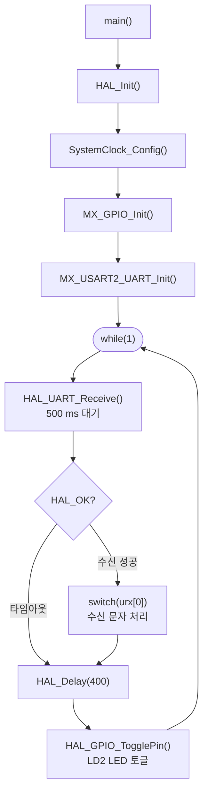

# UART와 GPIO 기초

USART2로 시리얼 출력을 활성화하고 GPIO 핀을 직접 제어하는 방법을 설명합니다.

`printf`를 UART에 연결하면 디버거 없이도 터미널에서 실행 결과를 바로 확인할 수 있습니다. GPIO 토글은 LED 상태 표시와 디지털 신호 출력의 기본이 됩니다.

---

<br>

## UART 설정

STM32CubeMX에서 USART2를 활성화한 뒤 아래 값으로 설정합니다.

| 파라미터 | 값 |
|---------|-----|
| 보레이트(Baud rate) | 115200 |
| 데이터 비트 | 8 |
| 패리티 | None |
| 정지 비트 | 1 |

생성된 `huart2` 핸들을 이후 `HAL_UART_Transmit()`과 `HAL_UART_Receive()`에서 사용합니다.

---

<br>

## printf 리디렉션

STM32 HAL 환경에서 `printf`는 기본적으로 동작하지 않습니다. `__io_putchar()`를 오버라이드해서 `printf` 출력을 USART2로 전달합니다.

```c
#ifdef __GNUC__
#define PUTCHAR_PROTOTYPE int __io_putchar(int ch)
#else
#define PUTCHAR_PROTOTYPE int fputc(int ch, FILE *f)
#endif

PUTCHAR_PROTOTYPE
{
    HAL_UART_Transmit(&huart2, (uint8_t *)&ch, 1, 0xFFFF);
    return ch;
}
```

이 코드를 `/* USER CODE BEGIN 0 */` 영역에 작성합니다. 이후 `printf("hello\r\n")`를 호출하면 PC의 터미널(CoolTerm, PuTTY 등)에서 출력을 확인할 수 있습니다.

> `\r\n`을 사용하는 이유: Windows 터미널은 CR+LF(`\r\n`) 줄바꿈을 기대합니다. `\n`만 사용하면 일부 터미널에서 줄이 올바르게 바뀌지 않습니다.

---

<br>

## UART 수신

`HAL_UART_Receive()`는 지정한 타임아웃(ms) 동안 데이터를 기다립니다. 수신에 성공하면 `HAL_OK`를 반환합니다.

```c
HAL_StatusTypeDef urx_status;
uint8_t urx[8];

urx_status = HAL_UART_Receive(&huart2, urx, 1, 500); // 500ms 대기
if (HAL_OK == urx_status) {
    printf("수신: %c (%d, 0x%x)\r\n", urx[0], urx[0], urx[0]);
    switch (urx[0]) {
    case 'a':
        printf("a 입력됨\r\n");
        break;
    case 'b':
        printf("b 입력됨\r\n");
        break;
    }
}
```

타임아웃 동안 데이터가 없으면 `HAL_TIMEOUT`을 반환하고 다음 코드로 진행합니다. 메인 루프에서 `HAL_Delay`와 함께 사용하면 주기적으로 명령을 받아 처리할 수 있습니다.

---

<br>

## GPIO 출력 제어

`HAL_GPIO_WritePin()`으로 핀을 HIGH 또는 LOW로 설정하고, `HAL_GPIO_TogglePin()`으로 현재 상태를 반전합니다.

```c
// PA5 (LD2 LED) 토글: 400ms마다 반전
HAL_Delay(400);
HAL_GPIO_TogglePin(GPIOA, GPIO_PIN_5);
```

STM32F103 Nucleo 보드에서 `PA5`는 사용자 LED(LD2)에 연결되어 있습니다. 이 핀을 토글하면 LED가 점멸합니다.

---

<br>

## 동작 흐름



---

<br>

## 참고 사항

- `HAL_UART_Receive()`는 **블로킹(blocking)** 함수입니다. 타임아웃 시간 동안 메인 루프 전체가 멈춥니다. 나중에 ISR 기반 구조로 전환하면 이 문제를 해결할 수 있습니다. ([06-system-integration.md](./06-system-integration.md) 참고)
- `HAL_Delay()`도 블로킹 함수입니다. 초음파 센서나 IR 센서와 조합하려면 타이머 인터럽트 기반으로 변경해야 합니다.
