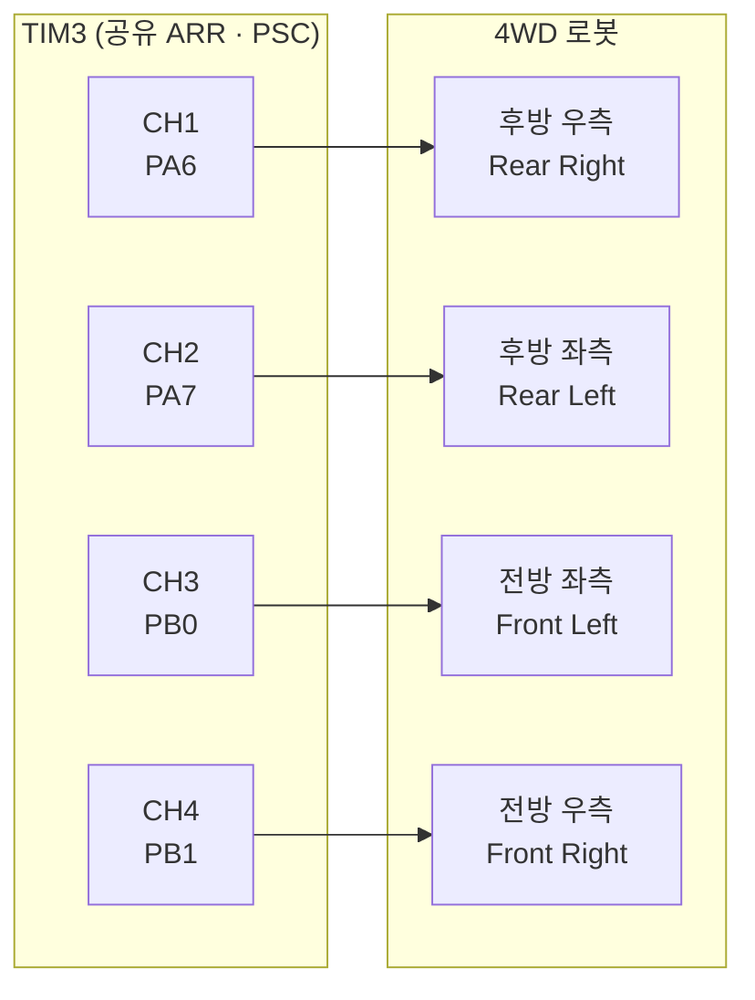

# TIM3으로 PWM 출력하기

타이머 레지스터 PSC·ARR·CCR을 계산하여 원하는 주파수와 듀티비의 PWM 신호를 출력하는 방법을 설명합니다.

PWM(Pulse Width Modulation)을 사용하면 DC 모터의 속도를 아날로그 신호 없이 디지털로 제어할 수 있습니다. STM32F103의 TIM3은 CH1~CH4를 동시에 출력할 수 있어 4WD 모터 드라이버에 적합합니다.

---

<br>

## PWM 동작 원리

타이머는 0부터 ARR 값까지 카운트하고 다시 0으로 돌아갑니다. 카운터 값이 CCR보다 작으면 출력 핀을 HIGH, CCR 이상이면 LOW로 유지합니다. 이로써 규칙적인 주기의 펄스 신호가 만들어집니다.

- **주파수(Hz)** = 타이머 입력 클럭 / PSC / ARR
- **듀티비(%)** = CCR / ARR × 100

---

<br>

## PSC · ARR · CCR 계산

STM32F103의 타이머 입력 클럭은 시스템 클럭 설정에 따라 결정됩니다. 이 프로젝트에서 TIM3의 입력 클럭은 **64 MHz**입니다.

> APB1 프리스케일러가 2분주이므로 PCLK1 = 32 MHz, 타이머는 ×2 체배되어 TIM 클럭 = 64 MHz입니다.

**100 Hz PWM을 설정하는 예:**

```
목표 주파수 = 100 Hz
PSC = 640  →  프리스케일러: 64,000,000 / 640 = 100,000 Hz
ARR = 1000 →  100,000 / 1,000 = 100 Hz
```

| 레지스터 | 계산값 | 실제 설정값 |
|---------|--------|------------|
| PSC | 640 | 640 - 1 = **639** |
| ARR | 1,000 | 1,000 - 1 = **999** |

> STM32는 PSC와 ARR을 0부터 세므로 실제 레지스터에는 목표값에서 1을 뺀 값을 씁니다.

**듀티비 50% 설정:**

```c
CCR = (ARR * duty_percent) / 100
    = (999 * 50) / 100
    = 499
```

---

<br>

## 코드 예시

### PWM 시작

```c
HAL_TIM_PWM_Start(&htim3, TIM_CHANNEL_2); // CH2 출력 시작
```

<br>

### 런타임에서 듀티비 변경

```c
uint32_t tim3_ARR  = htim3.Instance->ARR;  // 현재 ARR 읽기

// 듀티비 50%
htim3.Instance->CCR2 = (tim3_ARR * 50) / 100;

// 듀티비 90%
htim3.Instance->CCR2 = (tim3_ARR * 90) / 100;
```

CCR 레지스터를 직접 쓰면 PWM을 멈추지 않고도 즉시 듀티비를 바꿀 수 있습니다.

<br>

### 런타임에서 주파수 변경

주파수를 바꾸려면 PSC 또는 ARR을 변경해야 합니다. ARR을 바꾸면 CCR도 함께 재계산해야 듀티비가 유지됩니다.

```c
// 예: 2 kHz로 변경 (PSC=639 고정, ARR을 50으로 줄임)
htim3.Instance->ARR  = 50 - 1;
htim3.Instance->CCR2 = (50 * 50) / 100; // 50% 듀티비 유지
```

---

<br>

## TIM3 채널과 핀 매핑

이 프로젝트의 4WD 구성에서 TIM3 채널은 다음과 같이 배분됩니다.

| TIM3 채널 | GPIO 핀 | 담당 바퀴 |
|----------|---------|---------|
| CH1 | PA6 | 후방 우측(RR) |
| CH2 | PA7 | 후방 좌측(RL) |
| CH3 | PB0 | 전방 좌측(FL) |
| CH4 | PB1 | 전방 우측(FR) |



4개 채널이 동일한 ARR을 공유하므로 PWM 주파수는 모든 바퀴에 동일하게 적용됩니다.

---

<br>

## 참고 사항

- `HAL_TIM_PWM_Start()`를 호출하기 전에 반드시 `MX_TIM3_Init()`이 실행되어야 합니다.
- CCR 레지스터에 ARR보다 큰 값을 쓰면 듀티비가 100%가 되어 핀이 항상 HIGH 상태가 됩니다.
- TIM3 자체는 PWM 출력 전용으로 사용합니다. 인터럽트 없이 하드웨어가 자동으로 출력합니다. ([06-system-integration.md](./06-system-integration.md) 참고)
