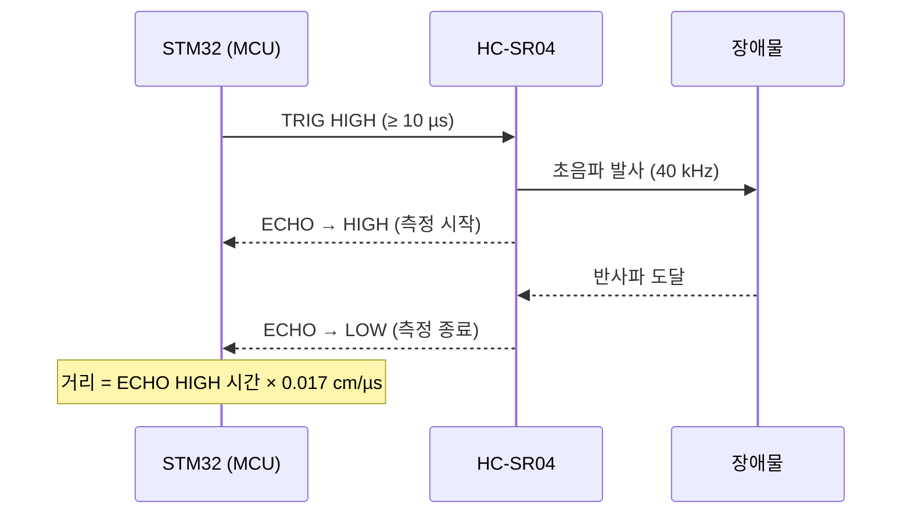
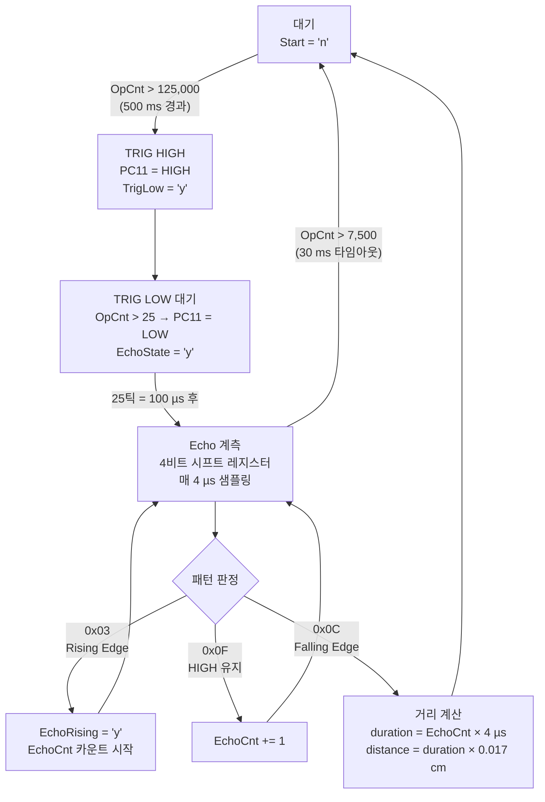

# HC-SR04 인터럽트 기반 거리 측정

TIM2 ISR 안에서 소프트웨어 상태 머신을 구현하여 `HAL_Delay` 없이 HC-SR04 초음파 센서로 거리를 측정하는 방법을 설명합니다.

`HAL_Delay`를 사용하면 초음파 측정 중 MCU 전체가 멈춥니다. 타이머 인터럽트 기반으로 구현하면 거리 측정과 모터 제어, 센서 폴링을 동시에 수행할 수 있습니다.

---

<br>

## HC-SR04 동작 원리

HC-SR04는 초음파(40 kHz)를 발사하고 반사파가 돌아오는 시간으로 거리를 계산합니다.

1. TRIG 핀에 **10 µs 이상** HIGH 펄스를 보냅니다.
2. 센서가 초음파를 발사하면 ECHO 핀이 HIGH가 됩니다.
3. 초음파가 장애물에 반사되어 돌아오면 ECHO 핀이 LOW로 내려갑니다.
4. ECHO 핀이 HIGH였던 시간(µs)으로 거리를 계산합니다.

```
거리(cm) = ECHO HIGH 시간(µs) × 음속(0.034 cm/µs) ÷ 2(왕복)
         = ECHO HIGH 시간(µs) × 0.017 cm/µs
```



---

<br>

## TIM2 타이밍 설계

HC-SR04의 TRIG 펄스(최소 10 µs)를 정확히 제어하려면 µs 단위 타이머가 필요합니다. TIM2를 **4 µs** 주기로 설정하여 사용합니다.

```
f_tick = 64 MHz / PSC / ARR
       = 64,000,000 / 32 / 8
       = 250,000 Hz  →  주기 4 µs
```

| 레지스터 | 계산값 | 실제 설정값 |
|---------|--------|------------|
| PSC | 32 | 32 - 1 = **31** |
| ARR | 8  | 8 - 1 = **7** |

**틱 기준 주요 임계값:**

| 구간 | 시간 | 틱 수 |
|------|------|-------|
| 측정 간격 (HCSR04_OpTime = 500 ms) | 500 ms | 500,000 / 4 = **125,000** |
| TRIG HIGH 유지 | 100 µs | 100 / 4 = **25** |
| Echo 측정 타임아웃 | 30 ms | 30,000 / 4 = **7,500** |

---

<br>

## ISR 상태 머신

TIM2 ISR 안에서 플래그 변수(`char` 타입, `'y'`/`'n'`)로 상태를 관리합니다. 매 4 µs마다 ISR이 호출되며, 현재 상태에 따라 다음 동작을 수행합니다.



```c
void HAL_TIM_PeriodElapsedCallback(TIM_HandleTypeDef *htim)
{
    if (htim->Instance == htim2.Instance) {
        tim2_HCSR04_OpCnt += 1;

        // 1단계: 측정 간격 대기 (500ms)
        if ('n' == tim2_HCSR04_Start) {
            if (125000 < tim2_HCSR04_OpCnt) {
                tim2_HCSR04_OpCnt = 0;
                tim2_HCSR04_Start = 'y';
                tim2_HCSR04_TrigHigh = 'y';
            }
        }

        if ('y' == tim2_HCSR04_Start) {
            // 2단계: TRIG HIGH
            if ('y' == tim2_HCSR04_TrigHigh) {
                tim2_HCSR04_TrigHigh = 'n';
                HAL_GPIO_WritePin(GPIOC, GPIO_PIN_11, GPIO_PIN_SET); // PC11
                tim2_HCSR04_TrigLow = 'y';
            }
            // 3단계: 100µs 후 TRIG LOW
            if ('y' == tim2_HCSR04_TrigLow) {
                if (25 < tim2_HCSR04_OpCnt) {
                    tim2_HCSR04_OpCnt = 0;
                    tim2_HCSR04_TrigLow = 'n';
                    HAL_GPIO_WritePin(GPIOC, GPIO_PIN_11, GPIO_PIN_RESET);
                    tim2_EchoSample = 0x00;
                    tim2_EchoCnt = 0;
                    tim2_HCSR04_EchoState = 'y';
                }
            }
            // 4단계: Echo 계측
            if ('y' == tim2_HCSR04_EchoState) {
                // ... (아래 노이즈 필터링 및 거리 계산 참고)
            }
        }
    }
}
```

---

<br>

## 노이즈 필터링: 4비트 시프트 레지스터

Echo 핀을 매 4 µs마다 샘플링하고 4비트 시프트 레지스터에 누적하여 스파이크 노이즈를 제거합니다.

```c
tim2_EchoSample = (tim2_EchoSample << 1) & 0x0F;
if (GPIO_PIN_SET == HAL_GPIO_ReadPin(GPIOC, GPIO_PIN_10)) { // PC10
    tim2_EchoSample |= 0x01;
}

if (0x03 == tim2_EchoSample) tim2_EchoRising  = 'y'; // 0b0011 → Rising
if (0x0F == tim2_EchoSample) tim2_EchoCnt += 1;       // 0b1111 → HIGH 구간 카운트
if (0x0C == tim2_EchoSample) tim2_EchoFalling = 'y';  // 0b1100 → Falling
```

단일 샘플 변화가 아닌 **연속 2회 동일 값**이 확인될 때만 엣지로 판정하므로 오검출이 줄어듭니다.

| 패턴 | 이진값 | 의미 |
|------|-------|------|
| `0x03` | `0011` | Rising Edge (LOW→HIGH 전환) |
| `0x0F` | `1111` | HIGH 유지 구간 |
| `0x0C` | `1100` | Falling Edge (HIGH→LOW 전환) |

---

<br>

## 거리 계산

Falling Edge가 감지되면 즉시 거리를 계산합니다. `EchoCnt += 3`은 Rising Edge 감지에 걸린 2틱과 Falling Edge 처리 지연 1틱을 보정하는 값입니다.

```c
if ('y' == tim2_EchoFalling) {
    tim2_EchoCnt += 3; // 엣지 감지 지연 보정
    HCSR04_duration = 4.0 * (double)tim2_EchoCnt;  // µs
    HCSR04_distance = 0.017 * HCSR04_duration;      // cm
    tim2_HCSR04_EchoState = 'n';
    tim2_HCSR04_Start = 'n';
}
```

**계산 근거:**
- 음속 340 m/s = 0.034 cm/µs
- 왕복 거리이므로 ÷ 2 → **0.017 cm/µs**

30 ms(7,500틱) 이내에 Falling Edge가 감지되지 않으면 타임아웃 처리합니다. 이는 측정 가능한 최대 거리 약 255 cm를 초과한 경우입니다.

---

<br>

## 핀 배선

| 신호 | STM32 핀 | 방향 |
|------|---------|------|
| TRIG | PC11 | 출력 |
| ECHO | PC10 | 입력 |

---

<br>

## 참고 사항

- `tim2_HCSR04_OpCnt`는 ISR 안에서만 증가·초기화됩니다. 메인 루프에서 이 변수를 읽어도 측정에는 영향을 주지 않습니다.
- ISR 안에서 `printf()`를 호출하면 UART 전송 완료까지 블로킹이 발생합니다. 디버깅 목적으로만 사용하고 최종 코드에서는 제거하는 것이 좋습니다.
- TIM2·TIM3·TIM4를 함께 사용하는 통합 구조는 [06-system-integration.md](./06-system-integration.md)에서 설명합니다.
