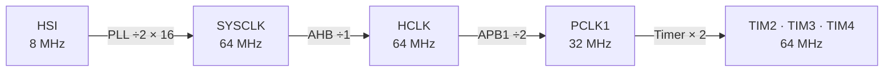
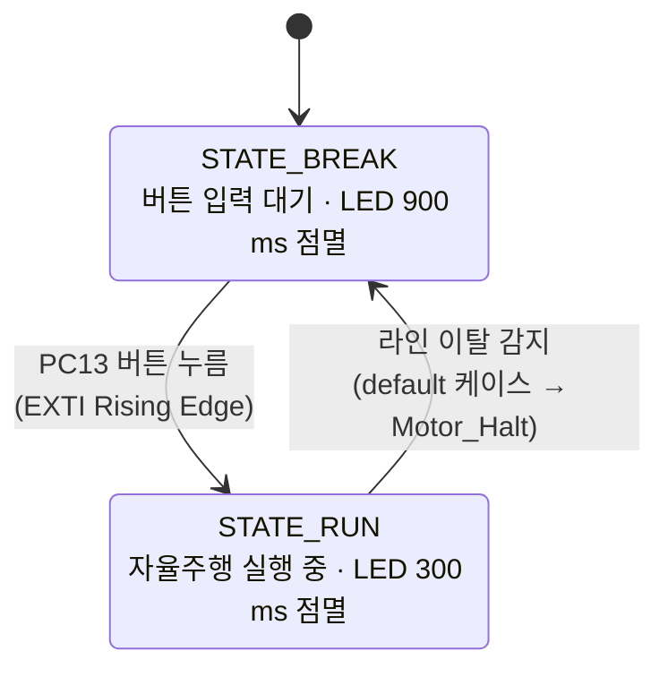
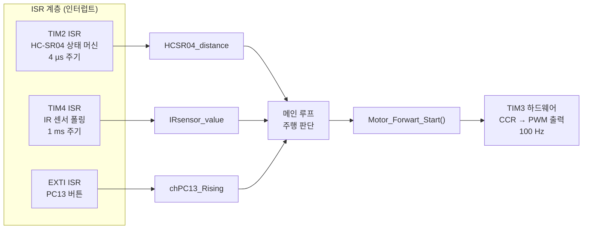

# TIM2 · TIM3 · TIM4 통합 운용

세 타이머를 역할에 따라 분리하고 EXTI 인터럽트를 추가하여, `HAL_Delay` 없이 모든 주변 장치를 동시에 제어하는 Non-blocking 아키텍처를 설명합니다.

각 타이머가 독립적으로 동작하기 때문에 HC-SR04 측정, 모터 PWM 출력, IR 센서 폴링이 서로를 차단하지 않습니다.

---

<br>

## 타이머 역할 분리

| 타이머 | 역할 | 주기 | 동작 방식 |
|-------|------|------|---------|
| TIM2 | HC-SR04 타이밍 상태 머신 | **4 µs** | ISR (인터럽트) |
| TIM3 | 4WD 모터 PWM 속도 출력 | **100 Hz** | 하드웨어 자동 출력, 인터럽트 없음 |
| TIM4 | IR 센서 샘플링 + LED 토글 | **1 ms** | ISR (인터럽트) |

TIM3은 한 번 시작하면 MCU 개입 없이 하드웨어가 PWM 신호를 출력합니다. CCR 레지스터를 변경하는 순간 자동으로 반영됩니다.

---

<br>

## 시스템 클럭

세 타이머 모두 APB1 버스에 연결됩니다. APB1 프리스케일러가 2분주이므로 타이머 입력 클럭은 PCLK1의 2배로 체배됩니다.



TIM2 · TIM3 · TIM4 모두 64 MHz를 입력으로 받습니다.

---

<br>

## ISR 구조

STM32 HAL은 `HAL_TIM_PeriodElapsedCallback()`을 하나만 제공합니다. 이 안에서 `htim->Instance`로 어느 타이머가 발생시킨 인터럽트인지 구분합니다.

```c
void HAL_TIM_PeriodElapsedCallback(TIM_HandleTypeDef *htim)
{
    if (htim->Instance == htim2.Instance) {
        // TIM2: HC-SR04 타이밍 상태 머신
        // (자세한 내용: 03-hcsr04.md)
    }
    if (htim->Instance == htim4.Instance) {
        // TIM4-1: IR 센서 30ms 폴링
        tim4_IRsensor_OpCnt += 1;
        if (IRsensor_OpTime < tim4_IRsensor_OpCnt) {
            tim4_IRsensor_OpCnt = 0;
            IRsensor_Read();
        }
        // TIM4-2: LD2 LED 상태 표시
        LD2_toggle_cnt += 1;
        if (LD2_toggle_OpTime < LD2_toggle_cnt) {
            LD2_toggle_cnt = 0;
            HAL_GPIO_TogglePin(GPIOA, GPIO_PIN_5);
        }
    }
}
```

TIM4 ISR 하나에서 IR 센서 폴링과 LED 토글을 독립 카운터로 처리합니다. 두 기능은 서로 다른 주기를 가지며 간섭하지 않습니다.

---

<br>

## EXTI 인터럽트: PC13 버튼

PC13(Nucleo 사용자 버튼 B1)에 EXTI를 설정하여 Rising Edge에서 콜백이 호출됩니다.

```c
void HAL_GPIO_EXTI_Callback(uint16_t GPIO_Pin)
{
    if (GPIO_Pin == GPIO_PIN_13) {
        chPC13_Rising = 'y'; // 메인 루프에서 감지
    }
}
```

EXTI 콜백은 비동기로 실행됩니다. 메인 루프에서 `chPC13_Rising == 'y'`를 확인하면 인터럽트 발생 여부를 알 수 있습니다.

---

<br>

## 상태 머신: STATE_BREAK ↔ STATE_RUN

메인 루프는 `uState` 변수로 두 상태를 전환합니다.

```c
#define STATE_BREAK  0x01
#define STATE_RUN    0x02
```

| 상태 | 설명 | LED 점멸 주기 |
|------|------|-------------|
| `STATE_BREAK` | 초기 상태. 버튼 입력 대기 | 900 ms (느린 점멸) |
| `STATE_RUN` | 자율주행 실행 중 | 300 ms (빠른 점멸) |



```c
while (1) {
    if (STATE_BREAK == uState) {
        if ('y' == chPC13_Rising) {
            chPC13_Rising = 'n';
            // 주행 시작 처리
            uState = STATE_RUN;
            LD2_toggle_OpTime = LD2_toggle_RUN; // 300ms
        }
    } else if (STATE_RUN == uState) {
        // 라인 트레이싱 로직
        // 라인 이탈 감지 시:
        // Motor_Halt();
        // uState = STATE_BREAK;
        // LD2_toggle_OpTime = LD2_toggle_BREAK; // 900ms
    }
}
```

`LD2_toggle_OpTime`을 바꾸는 순간 TIM4 ISR에서 다음 토글 주기부터 새 값이 적용됩니다.

---

<br>

## 초기화 순서

```c
int main(void)
{
    HAL_Init();
    SystemClock_Config();

    MX_GPIO_Init();
    MX_USART2_UART_Init();
    MX_TIM4_Init();   // IR 센서 + LED
    MX_TIM2_Init();   // HC-SR04
    MX_TIM3_Init();   // 모터 PWM

    HAL_TIM_Base_Start_IT(&htim2); // TIM2 인터럽트 시작
    HAL_TIM_Base_Start_IT(&htim4); // TIM4 인터럽트 시작
    Motor_PWM_Start();             // TIM3 PWM 출력 시작

    // 전역 변수 초기화
    uState = STATE_BREAK;
    chPC13_Rising = 'n';
    LD2_toggle_OpTime = LD2_toggle_BREAK; // 900ms
}
```

TIM3은 `HAL_TIM_Base_Start_IT()` 대신 `HAL_TIM_PWM_Start()`로 시작합니다. 인터럽트 없이 채널별 PWM 출력만 활성화합니다.

---

<br>

## 데이터 흐름



ISR은 데이터 수집과 상태 갱신만 담당합니다. 모터 제어 결정은 메인 루프에서 수행합니다.

---

<br>

## 참고 사항

- ISR 안에서는 최소한의 작업만 수행합니다. 복잡한 계산이나 `printf()`는 인터럽트 레이턴시를 높여 다른 ISR을 지연시킵니다.
- TIM2 ISR 우선순위가 TIM4 ISR보다 높아야 HC-SR04 타이밍 정확도가 유지됩니다. STM32CubeMX에서 `EXTI15_10_IRQn` priority를 0,0으로 설정합니다.
- `chPC13_Rising`은 메인 루프와 EXTI ISR이 공유하는 변수입니다. 1바이트 `char`이므로 추가 동기화 없이 안전하게 접근할 수 있습니다.
