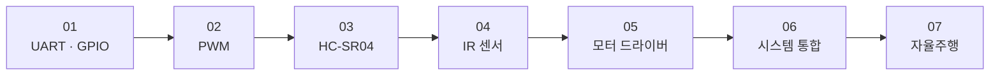

# 기술문서 목차

STM32F103 기반 4WD 자율주행 로봇 펌웨어의 구현 원리를 주제별로 설명하는 문서 모음입니다.

강의 템플릿 소스를 분석하여 학생 구현과의 차이, 설계 결정 이유, 핵심 수식과 레지스터 값을 구체적으로 기술합니다.

---

 

## 문서 구성

문서는 주변 장치 단위 설명(01~05)에서 시스템 통합(06)과 자율주행 완성(07) 순서로 읽도록 구성되어 있습니다.

| 번호 | 문서 | 핵심 내용 |
|------|------|----------|
| 01 | [UART와 GPIO 기초](./01-uart-gpio.md) | `printf` 리디렉션, UART 수신, GPIO 토글 |
| 02 | [TIM3으로 PWM 출력하기](./02-pwm.md) | PSC·ARR·CCR 계산, 4채널 PWM 매핑 |
| 03 | [HC-SR04 인터럽트 기반 거리 측정](./03-hcsr04.md) | TIM2 ISR 상태 머신, 4비트 노이즈 필터, 거리 공식 |
| 04 | [IR 센서 기반 라인 추종](./04-ir-sensor.md) | 4채널 인코딩, TIM4 30 ms 폴링 |
| 05 | [L298N 모터 드라이버 제어](./05-motor-driver.md) | H-Bridge 방향 제어, 부호 있는 PWM으로 역전 구현 |
| 06 | [TIM2 · TIM3 · TIM4 통합 운용](./06-system-integration.md) | Non-blocking 아키텍처, ISR 구조, 상태 머신 |
| 07 | [라인 트레이싱 자율주행 구현](./07-autonomous-driving.md) | `switch` 기반 주행 판단, 강의 템플릿과의 차이 |

---

 

## 읽는 순서

처음 접하는 경우 아래 순서를 권장합니다.

주변 장치별 문서(01~05)를 먼저 읽은 뒤 06에서 세 타이머가 하나의 시스템으로 통합되는 구조를 파악하고, 07에서 자율주행 최종 로직을 확인합니다.

---

 

## 문서별 한 줄 요약

1. **[UART와 GPIO 기초](./01-uart-gpio.md)**
   `printf`를 UART에 연결하여 디버거 없이 터미널에서 실행 결과를 확인하는 방법을 설명합니다.

2. **[TIM3으로 PWM 출력하기](./02-pwm.md)**
   PSC·ARR·CCR 레지스터 계산으로 100 Hz PWM을 생성하고 4채널을 독립 제어하는 방법을 설명합니다.

3. **[HC-SR04 인터럽트 기반 거리 측정](./03-hcsr04.md)**
   `HAL_Delay` 없이 TIM2 ISR 안의 상태 머신으로 초음파 거리를 측정하는 방법을 설명합니다.

4. **[IR 센서 기반 라인 추종](./04-ir-sensor.md)**
   4채널 IR 센서 값을 1바이트 비트 패턴으로 인코딩하여 라인 위치를 판단하는 방법을 설명합니다.

5. **[L298N 모터 드라이버 제어](./05-motor-driver.md)**
   음수 PWM 값으로 바퀴를 역전시켜 Tank Turn과 급격한 방향 전환을 단일 함수 호출로 구현하는 방법을 설명합니다.

6. **[TIM2 · TIM3 · TIM4 통합 운용](./06-system-integration.md)**
   세 타이머를 역할별로 분리하고 EXTI를 추가하여 모든 주변 장치를 동시에 제어하는 아키텍처를 설명합니다.

7. **[라인 트레이싱 자율주행 구현](./07-autonomous-driving.md)**
   `switch(IRsensor_value)` 하나로 직진·좌회전·우회전·비상 정지를 자동 결정하는 자율주행 로직을 설명합니다.
